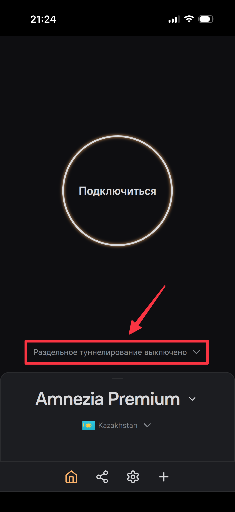
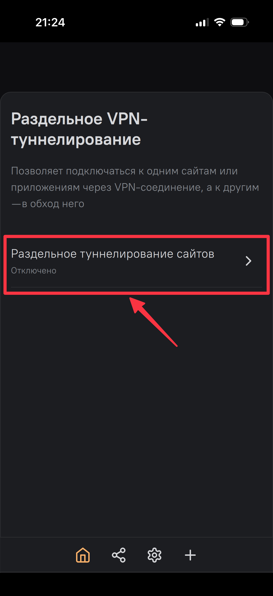
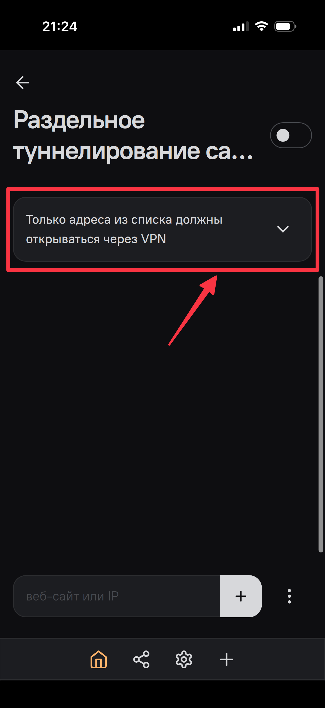
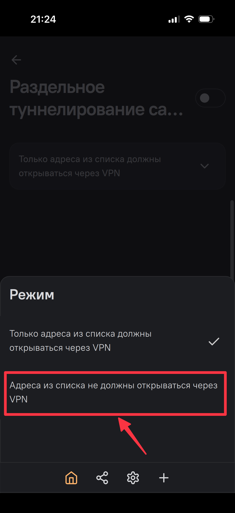
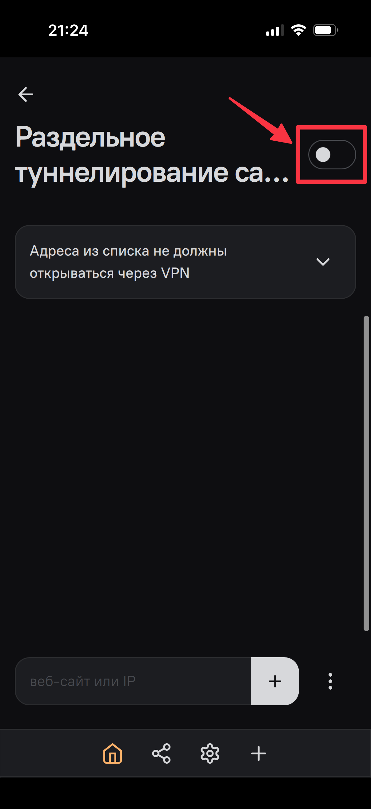
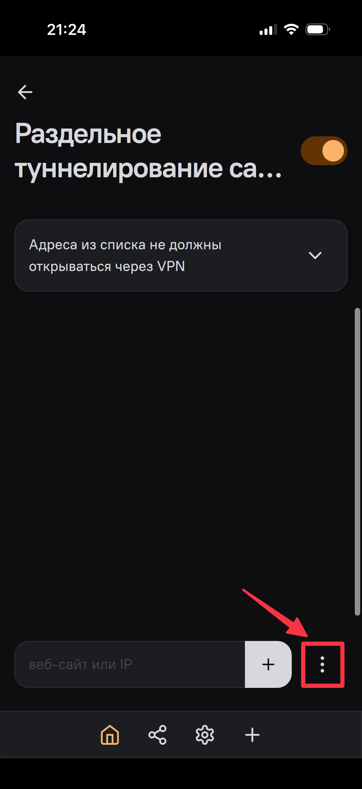
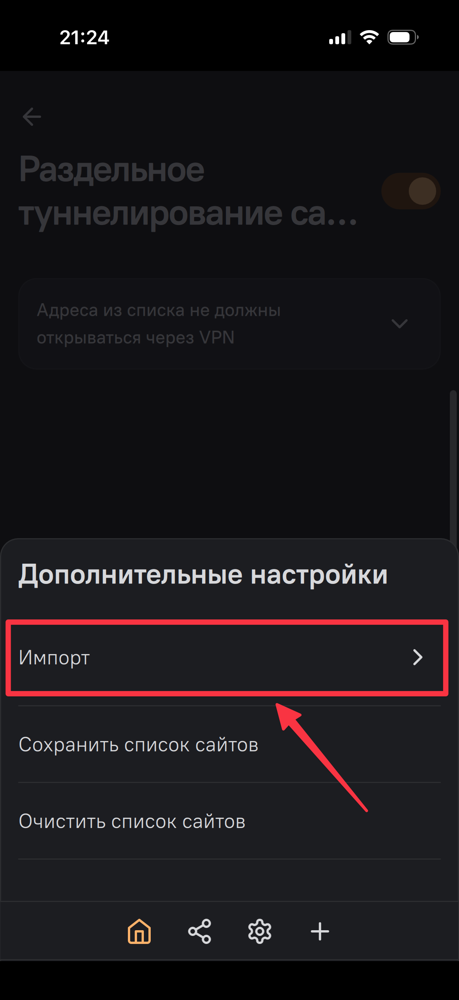
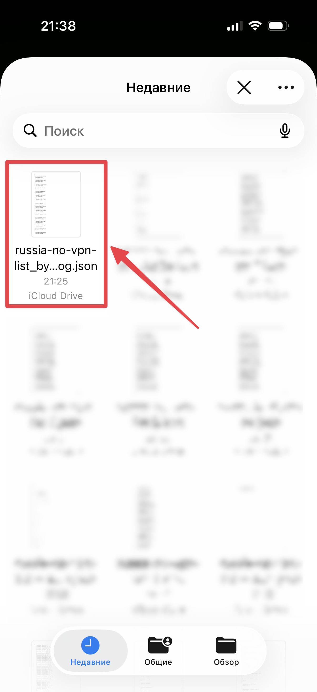
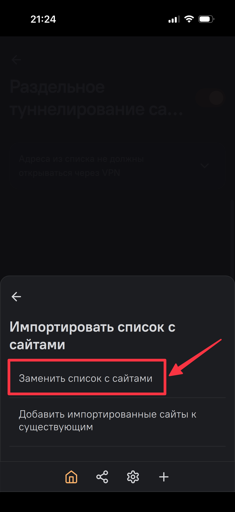
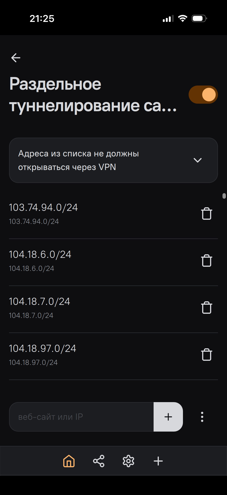

Роскомнадзор и Минцифры делают всё, чтобы пользоваться интернетом в России было неудобно — особенно с VPN.  
  
Всё больше российских сервисов под давлением регуляторов ограничивают доступ к своим приложениям и сайтам для пользователей с включённым VPN. Более того, российские IT-компании пытаются обязать выявлять использование VPN и передавать информацию о таких подключениях Роскомнадзору. Из-за этого пользоваться маркетплейсами, банками, сервисами Яндекса, государственными сервисами, мессенджером Макс (им вообще лучше не пользоваться) и т.д. и т.п. становится максимально неудобно.  
  
В итоге интернет превращается в постоянное переключение: чтобы открыть маркетплейс — выключи VPN, чтобы отправить ссылку на товар другу в Телеграм — включи VPN, чтобы потом провести оплату — снова выключи VPN… и так каждый час и каждый день.  
  
Но многие VPN-клиенты позволяют настраивать раздельное туннелирование трафика (Split Tunneling), которое позволяет решить данную проблему (хотя бы для 9 случаев из 10). Говоря на простом языке, нужно просто внести в список исключений IP-адреса российских сервисов, которые должны открываться без VPN — и они будут игнорироваться не смотря на то, что VPN на вашем устройстве будет оставаться включённым.  
  
В этом репозитории мы собрали [готовый файл](https://github.com/pvd-dog/russia-no-vpn-list/releases/latest) со списком таких адресов, адаптированный для [Amnezia VPN](https://amnezia.org/premium?arf=3GDUZYVJGVCXWP1D). Пользуйтесь и распространяйте!  
  
Мы планируем регулярно дополнять данный список, чтобы использование пользование интернетом не выключая VPN становилось всё более комфортным. Поэтому советуем сохранить ссылку на нас или на наш [Телеграм-канал](https://t.me/+xVs2Ycdg09dhMzE0) (там мы будем сообщать про обновления данного списка).  
  
## Подробная инструкция по настройке раздельного туннелирования для Amnezia VPN  
  
> [!WARNING]
> Если у вас ещё нет Amnezia VPN — сначала [установите с официального сайта](https://amnezia.org/premium?arf=3GDUZYVJGVCXWP1D).  
  
1. Скачайте из нашего репозитория файл [russia-no-vpn-list_by_@pvd_dog.json](https://github.com/pvd-dog/russia-no-vpn-list/releases/latest) на своё устройство.
  
2. Зайдите в приложение AmneziaVPN на своём устройстве, убедитесь, что VPN сейчас выключен, а затем нажмите на пункт «Раздельное туннелирование»:

  
4.   

  
5.  

  
6.  

  
7.  

  
8.  
 
  
9.  
 
  
10. Находите и выбираете файл, который вы сохранили в пункте 1 из нашего репозитория:  
 
  
11. Здесь вы можете выбрать как пункт «Заменить список с сайтами», так и «Добавить импортированные сайты к существующим» (если вдруг у вас в какой-то момент раздельное туннелирование перестало работать — замените список с сайтами на скачанный из нашего репозитория — у нас всё выверено).  
 
  
12. Убедитесь, что в списке появились IP-адреса:  
  
  
После этого российские сайты и сервисы будут открываться напрямую, VPN продолжит работать для остального интернета, не придётся постоянно включать и выключать VPN вручную.  
  
***  

> [!IMPORTANT]
> Мы стремимся дополнять данный список IP-адресов, поэтому если какой-то российский сервис или сайт у вас не открывается с включённым VPN и раздельный туннелированием — сообщите нам в комментариях к <a href="https://t.me/pvd_dog/46">данному посту в Телеграме</a> — мы обязательно внесём его IP-адреса в файл.  
  
***  
  
> [!TIP]
> Также вы можете поддержать нас поделившись информацией о нас со своими друзьями и подписавшись на наши ресурсы:  
>
> [Отряд Дурова](https://t.me/+xVs2Ycdg09dhMzE0) — наш Telegram-канал  
> [Выручай-Комната](https://t.me/+VoXJQ0F6cCQ4ZTA8) — наш чат  
  
  
  
  
  
  
